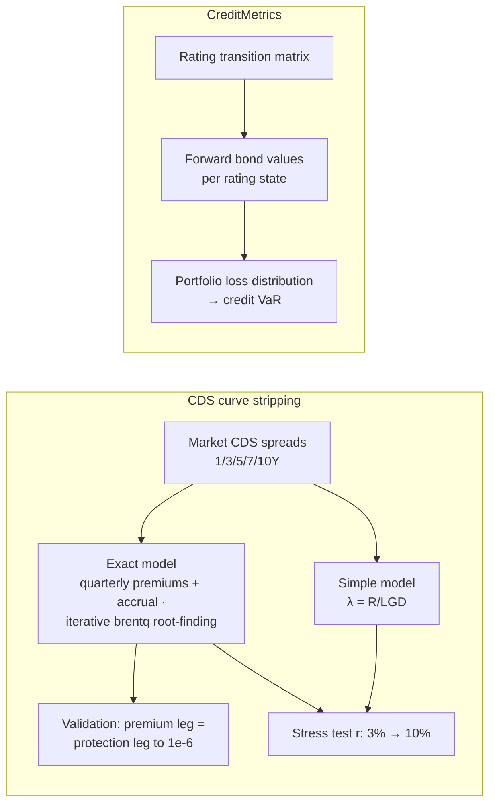

# Credit Risk Models: CDS Curve Stripping & CreditMetrics Portfolio Risk

Two self-contained credit-risk implementations, built from first principles (no QuantLib — the discretization loops are hand-rolled).

## CDS stripping — `notebooks/cds_curve_stripping.ipynb`
- **Simple model:** continuous premiums, average hazard λ(T) = R(T)/LGD → cumulative default probabilities and forward hazards.
- **Exact model:** quarterly premiums with accrued-premium-at-default; forward hazard rates solved **iteratively via `scipy.optimize.brentq`**, each maturity conditioning on the previously stripped segment.
- **Audit:** premium and protection legs of the 7Y CDS re-priced explicitly; difference < 1e-6.
- **Stress insight:** at r = 10% the simple model doesn't move (it never sees the discount curve) while the exact model does — the spread between them widens exactly when discounting matters most. Rate-sensitivity is a *model-choice* risk.

## CreditMetrics — `notebooks/creditmetrics_portfolio_risk.ipynb`
Rating-transition-matrix approach: forward values per rating state → portfolio credit loss distribution → credit VaR.
