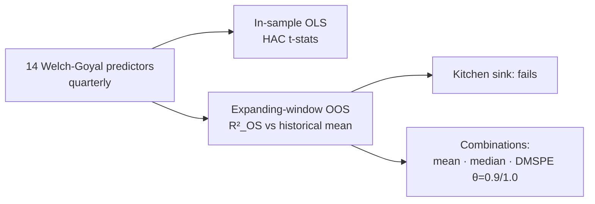

# Forecasting the Equity Risk Premium — and Cross-Validating the Forecaster

Can the classic Welch-Goyal (2008) predictors forecast the equity premium out of sample? Mostly no — individually. **Forecast combination is what survives**, which is precisely why my [trading system](../../../systematic-trading-system) has a forecast-combination layer instead of a favorite signal.

## Method
- In-sample predictive regressions r(t+1) = α + βx(t) + ε with HAC (Newey-West) inference, one-sided tests.
- Out-of-sample: expanding window (m=80q training, p=40q holdout, remainder OOS); Campbell-Thompson R²_OS against the historical-mean benchmark.
- Kitchen-sink multivariate regression vs. **combination forecasts**: equal-weight mean, median, and DMSPE (discounted MSPE weights from holdout performance, θ ∈ {0.9, 1.0}).

## The part I'm proudest of: independent cross-validation
This was group work in which a teammate produced results with heavy AI assistance. Rather than trust either output, **I re-implemented the entire pipeline from scratch, independently** (`equity_premium_forecasting.ipynb` alongside `forecasting_pipeline.py`) to cross-validate the two. The forecasts *disagreed* — and diffing the implementations traced it to an **off-by-one in the forecasting window** (using x(t) where x(t−1) belongs). Exactly the class of silent lookahead bug that ruins real-world backtests, and exactly why my trading system's validation protocol pre-registers its tests.

## Files
- `forecasting_pipeline.py` — clean end-to-end script
- `equity_premium_forecasting.ipynb` — independent implementation + EDA (PACF lag selection)
- Data: Welch-Goyal predictor dataset — download from [Amit Goyal's site](https://sites.google.com/view/agoyal145); not committed here.

*Group data collection credited to project teammates; all analysis code in this folder is my own.*
