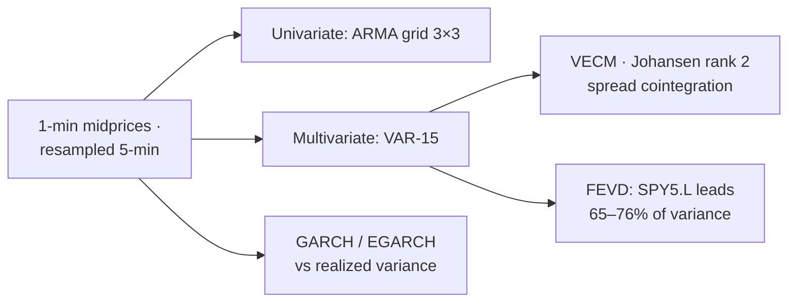

# Price Discovery in a Cross-Listed ETF — VAR/VECM Study

The SPDR S&P 500 UCITS ETF trades simultaneously in London (`SPY5.L`), on CHI-X (`SPY5z.CHIX`) and in Paris (`SPY5.P`). Using ~20 months of minute-level midprices: **who sets the price, and who follows?**

## Findings
- **Returns are ~unforecastable at 5-min:** ARMA(0,0) wins out of sample — consistent with weak-form efficiency — and *all* ARMA fits fail Ljung-Box, pointing at GARCH effects, not linear structure.
- **London is the price leader:** FEVD of the VAR(15) attributes 65% (CHI-X) and 76% (Paris) of forecast-error variance to LSE shocks; LSE is ~99% self-explained.
- **Cointegration is spread-shaped:** Johansen rank 2 with vectors ≈ (1,0,−1) and (0,1,−1) — cross-exchange spreads are stationary and all venues error-correct.
- **Volatility is the real dynamic:** EGARCH(2,2) captures a significant leverage effect; conditional variance tracks realized variance well.

Why it matters to me: price leadership and error-correction speed are exactly the microstructure quantities my [execution thesis](../../../rl-optimal-execution) exploits.

## Notes
`notebooks/price_discovery_vecm.ipynb` (outputs stripped — original had 40MB of them; run to regenerate). Data: minute-level ETF midprices via ETFbook (licensed, not redistributed).
