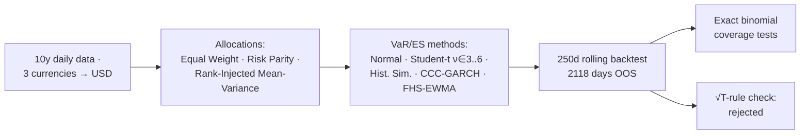

# VaR & ES: Five Models, Three Portfolios, One Verdict from 2118 Days of Backtests

How well do standard market-risk models actually cover the 99% tail? A multi-currency six-asset portfolio (Maersk/DKK, Agnico Eagle/USD, ASML/EUR, S&P 500, Euro Stoxx 50, 3M T-Bill floating leg), three allocation rules, five VaR/ES methods, and a 250-day rolling out-of-sample backtest over **2118 trading days** with exact binomial coverage tests.

## Key results
- **No model dominates across portfolios.** Diversified EW: Student-t and FHS-EWMA pass coverage. Risk parity: only Student-t. The concentrated RMV portfolio breaks nearly everything — CCC-GARCH logs 178 violations vs 21 expected.
- **Normal VaR systematically under-covers** (56 violations vs 21.18 expected on EW) — fat tails are not optional.
- **The √T scaling rule fails:** empirical non-overlapping 5-day HS VaR is ~13pp above the √5-scaled 1-day figure. Multi-day risk must be estimated at its own horizon.
- **Sample choice is a model input:** FHS-EWMA VaR triples between calm and crisis estimation windows (1.83% → 5.43%); CCC-GARCH is smoother but slower to learn.
- Violations cluster in stress periods (2018, 2020, 2022+) — unconditional coverage tests understate the problem.

## Contents
- `notebooks/var_es_pipeline.ipynb` — full pipeline (outputs stripped; run to regenerate). Sections: data & FX conversion → allocation rules → univariate VaR/ES (5 methods, QQ-based ν selection) → portfolio VaR/ES → rolling backtest + binomial tests → multi-day VaR vs √T.
- Data: Yahoo Finance + FRED (DTB3) — pulled at runtime, not committed.

